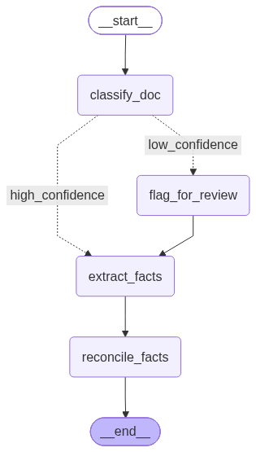
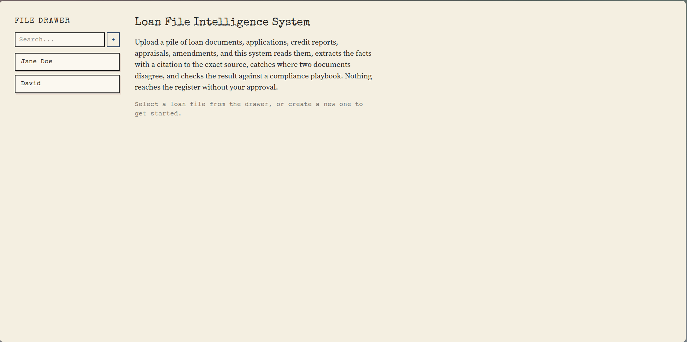

# Loan File Intelligence System

An agentic system that owns a loan file end to end: understands a pile of
mixed-format documents, checks it against an underwriting playbook, and
stays current as new documents arrive, with a human gate on every commit
and an MCP interface so a machine can drive the whole flow.

This README is written incrementally as the project is built, not all at
once at the end. Sections marked "not yet built" are genuinely not built
yet, not placeholders.

## Setup

Requires Docker and a free Groq API key (console.groq.com, no card / payment
required).

1. `cp backend/.env.example backend/.env`, fill in `GROQ_API_KEY`
2. `cp frontend/.env.example frontend/.env` (default value already points
   at the local backend, no edit needed unless you're running the
   backend somewhere other than `127.0.0.1:8000`)
3. `sudo ./setup.sh`

This starts a local Postgres (with pgvector) in Docker, installs both
backend and frontend dependencies, runs every pending migration, and
starts both servers. Backend at http://127.0.0.1:8000/docs, frontend
at http://localhost:5173.

To also run the file watcher (automatic processing of
files dropped into `backend/watched_incoming/<loan_file_id>/`), in a
separate terminal: `cd backend && source venv/bin/activate && python -m app.watcher`

## What's built so far

- FastAPI app with health check and local connection pooling.

- `loan_files` and `documents` tables, via versioned migrations in
  `db/migrations/` (applied with `app/migrate.py`, not by hand in a web
  editor)

- Document upload endpoint with content-hash based dedup (`UNIQUE`
  constraint on `loan_file_id, content_hash`)

- A LangGraph classification graph (`app/graph/`): one node calls Groq
  to classify a document's type, a conditional edge routes low-confidence
  results to a `flag_for_review` node instead of accepting a guess
  silently
    - Extraction (`app/graph/nodes.py::extract_facts`): pulls structured
      facts (loan_amount, income, dti_ratio, etc) from documents into an
      append-only `extracted_facts` table, each fact stores the exact quote
      it was extracted from as a citation

- Reconciliation (`app/graph/nodes.py::reconcile_facts`): compares a
  newly extracted fact against the most recent fact on record for the
  same field, opens a row in `conflicts` if they disagree beyond
  tolerance instead of silently picking one. Numbers get a tolerance
  for formatting differences, everything else needs an exact match

- Human review queue and register: `register` holds only approved
  facts, `review_queue` holds pending decisions, `POST
/review/{item_id}/decide` is the single approval gate, rejecting one
  item is its own transaction and never touches siblings,
  `register_history` is an append-only audit trail

- **Resumability uses LangGraph's built-in Postgres checkpointer**
  rather than custom save/resume logic. thread_id = run_id, a `runs`
  table records the run_id before the graph starts so it survives a
  crash even if the process dies before responding to the request.

- **MCP server** (`app/mcp_server.py`) exposes register/facts/conflicts
  reads, the review-decision gate, and document processing/resume as
  tools, both REST and MCP call into the same `app/operations.py`
  functions, so a human via `/docs` and a program via MCP get
  identical behavior with no duplicated logic. The MCP server builds
  and holds its own compiled graph at startup, same pattern the
  watcher uses, since each process needs its own graph object in
  memory.

- rule/playbook checking: `app/rules.py` runs a
  user-supplied playbook (`app/playbook.yaml`) against a loan file,
  one findings row per rule per stage (completeness, accuracy,
  consistency, regulatory), always written even when clean, so "no
  findings" is a real queryable result. Four rules implemented:
  required doc types present, loan amount consistency after
  amendments, embedded-instruction scanning, appraisal recency window.

- watched directory: `app/watcher.py` watches
  `watched_incoming/<loan_file_id>/`, on a new `.txt` file, ingests it
  with the same content-hash dedup as the upload endpoint and runs
  the pipeline on just that one document, not the whole loan file.
  Shares `process_document_op` with the REST `/process` endpoint via
  `app/operations.py`, so both entry points behave identically.

- Automated tests (`tests/`): no live LLM key required, `app/llm.py`
  has a test-only override hook. Covers embedded-instruction detection
  (fake LLM that would comply if asked, proving safety comes from the
  rule not the model), concurrent-run serialization on the same loan
  file vs parallel execution on different ones, and resumability via
  LangGraph's `interrupt_after`.

- Cost tracking: `app/llm.py` records token usage and latency per call
  in memory, drained into `cost_log` after each run, tagged by stage
  (classify_doc, extract_facts). GET /runs/{run_id}/cost returns
  totals grouped by stage. Groq's free tier has no per-token billing,
  so this reports token counts and latency, not a dollar figure,
  fabricating a cost number against a free API would be dishonest.

- React frontend (`frontend/`): file drawer with search and
  pagination, tabbed loan file view (Register, Review Queue,
  Findings, Changelog, Cost), upload with per-file status and
  duplicate/resume detection, playbook check triggerable from the
  UI. "Case File" design system, carbon-copy shadow cards, rubber-
  stamp status badges, typewriter/monospace typography, deliberately
  distinct from a generic dashboard look.

- Loan file deletion: DELETE /loan-files/{id} cascades through every
  related table (cost_log, review_queue, findings, conflicts,
  register_history, register, extracted_facts, runs, documents) in
  FK-safe order inside one transaction, confirmed in the UI before
  firing.

- Changelog shows what actually happened, not just that a field
  changed: approved/kept new/kept old/rejected/superseded, joined
  through to the source document filename. register_history gained
  an `action` column to record which decision produced each row.

## Key decisions made while building

- **Groq instead of Anthropic for the LLM calls.** Free tier, no card
  required, sufficient for structured extraction/classification tasks.

- **Migrations are versioned `.sql` files in `db/migrations/`, applied by
  a Python runner (`app/migrate.py`)** A `schema_migrations` table tracks what's already applied so
  the runner is safe to re-run. Every migration uses
  `CREATE TABLE IF NOT EXISTS` / `ADD COLUMN IF NOT EXISTS` for safety.

- **Confidence-based routing in the classification graph uses a threshold
  of 0.85, not the more intuitive-sounding 0.5.** Testing showed Llama
  3.3's self-reported confidence is poorly calibrated: even genuinely
  ambiguous, non-loan-related text (e.g. unrelated call notes) scored
  0.8 confidence. Self-reported LLM confidence is a heuristic, not a
  calibrated probability.

- **Schema columns are added when the phase that populates them is
  built, not all up front.** `doc_type` and `doc_type_confidence` were
  added to `documents` slightly ahead of the classification node (a
  deliberate small exception) so the column and the code that fills it
  could be reviewed together.

- **Reconciliation originally only compared new facts against the
  approved register, not against other pending review items.**
  Building the watcher and feeding it several documents for the same
  loan file surfaced this: multiple documents mentioning the same
  unapproved field each spawned their own `register_update` item
  instead of joining the one already waiting. Fixed by having
  `_fetch_existing_facts` also check pending `register_update` items,
  and by superseding a pending item into a real conflict if a later
  document disagrees with it before a human ever saw it.
  `extracted_facts` stayed intentionally append-only throughout, the
  fix was entirely in what counts as "the current candidate value" for
  reconciliation, not in the fact history itself.
  This fix alone wasn't sufficient though, testing with a full folder of documents
  dropped at once still produced duplicates, because two runs could
  both read the same "nothing pending yet" state before either had
  written its result. That was a concurrency gap, not a
  reconciliation gap, and needed the locking mechanism fix below to fully close.

- **Concurrency serialization uses `pg_advisory_xact_lock` (transaction-
  scoped), not the plain session-scoped `pg_advisory_lock`.** The
  session version only releases on an explicit unlock call, so a run
  that fails partway through would leave the lock held forever,
  hanging every future run on that loan file. The transaction-scoped
  version (`pg_advisory_xact_lock`) releases automatically on commit or rollback, no leak is
  possible. Lock key computed via Postgres's `hashtextextended`
  rather than Python's `hash()`, which is randomized per process and
  would let the watcher and API server compute different keys for the
  same loan file.

- **Writing the injection test caught a real bug**: the playbook rule
  referenced `no_embedded_instructions`, `CHECK_FUNCTIONS` was keyed
  `no_embedding_instructions`. The mismatch meant the embedded-
  instruction rule silently returned `inconclusive` every time instead
  of ever running, no error, no crash, just quietly not checking
  anything. Would not have been caught by manual testing alone.

- **Cost logging happens in `app/llm.py`, not inside graph nodes.**
  Nodes were deliberately kept free of direct database access. Usage is buffered in
  memory during a run and drained into `cost_log` by
  `operations.py` right after the graph finishes, same place facts
  and conflicts already get persisted, keeping that separation intact.

- **Two cost endpoints, not a duplicate**: `/runs/{id}/cost` reports
  one run in isolation (debugging a specific execution),
  `/loan-files/{id}/cost` sums across every run for that loan file
  (what the UI displays, since it works in loan-file terms and never
  holds onto individual run_ids).

- **Switched from Neon to local Docker Postgres.** Neon required a
  manual account creation and a SQL-editor step to enable pgvector,
  neither scriptable, which directly blocked one-command onboarding.
  `pgvector/pgvector:pg16` ships the extension pre-installed,
  `setup.sh` brings the container up, waits for it to actually accept
  connections (not just for the container to start), and creates the
  extension automatically.

- **Frontend's API base URL is `VITE_API_BASE_URL` in `frontend/.env`**,
  not hardcoded, so the frontend can point at a different backend
  address without a code change.

- **Switched from `llama-3.3-70b-versatile` to `openai/gpt-oss-120b`**
  on Groq mid-build, the original model was decommissioned by Groq.

## Repo layout

```
backend/app/
  main.py             FastAPI app and all routes
  operations.py       Shared logic, called by both REST routes and MCP tools
  db.py               Local Postgres connection pool, loan_file_lock
  migrate.py          Migration runner
  llm.py              Groq API client, cost logging, test override hook
  rules.py            Playbook rule engine
  playbook.yaml       User-supplied compliance rules
  watcher.py          Watched-directory processor
  mcp_server.py       MCP tools, mirrors REST routes exactly
  graph/
    state.py            LangGraph state definition
    nodes.py            Node functions
    build.py             Graph assembly and routing
    checkpointer.py      Postgres checkpointer setup
db/migrations/          Versioned schema changes, applied via app/migrate.py
tests/                    Injection, concurrency, resumability tests
frontend/src/
  api.js                  All fetch calls
  index.css               Design tokens
  App.jsx                  Layout shell, tab routing
  components/
    StatusStamp,
    Card,
    FileDrawer,
    RegisterLedger,
    ReviewQueue,
    FindingsList,
    ChangelogTicker,
    CostReport,
    DocumentToolbar
```

## Graph layout



## Screenshots

Landing Page


Register


Review Queue


Findings


Changelogs


Cost

